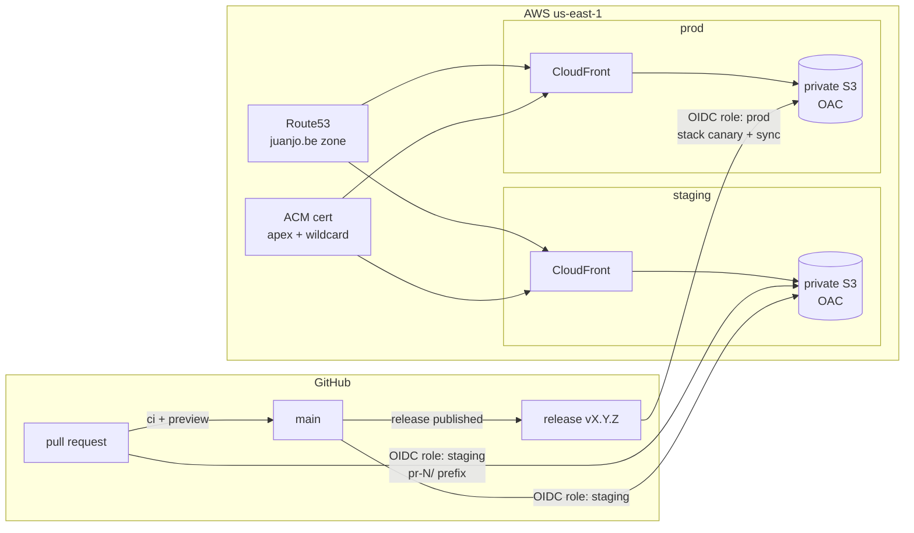

# juanjo.be

[](https://github.com/juanjo1997/juanjo.be/actions/workflows/ci.yml)

Personal site of Juan Beltran — software engineering, DevOps, cloud
infrastructure, FinOps.

This repo is deliberately over-engineered for a static site: it doubles as a
working example of how I build and run things. Every significant decision is
recorded as an ADR in [`docs/adr/`](docs/adr/), starting with why each piece
of the stack was chosen over its alternatives.

## Architecture



- **Site**: Next.js static export, App Router, strict TypeScript, hand-written
  CSS design system — no UI framework ([`site/`](site/))
- **Infra**: raw CloudFormation; private S3 behind CloudFront with Origin
  Access Control, security headers, and a unit-tested edge router function
  ([`infra/`](infra/))
- **CI/CD**: GitHub Actions authenticating to AWS via OIDC — no stored cloud
  credentials anywhere ([`.github/workflows/`](.github/workflows/))
- **Quality gates on every PR**: 100% unit coverage (enforced), Playwright
  integration tests, axe accessibility scans, visual-regression snapshots,
  Lighthouse budgets (perf ≥ 95, a11y = 100), `cfn-lint`
- **GitOps**: PRs deploy previews, `main` deploys staging, releases apply
  infra changes and deploy prod; weekly drift detection fails loudly if
  reality diverges from the templates

## Environments

| Env | URL | Deployed by |
|-----|-----|-------------|
| PR preview | `staging.juanjo.be/pr-<n>/` | every pull request |
| Staging | `staging.juanjo.be` | merge to `main` |
| Production | `juanjo.be` | published GitHub Release |

The footer of the deployed site links to the exact commit it was built from.

## Cost

The FinOps corner: ~$0.50/month (hosted zone) + pennies of S3/CloudFront, plus
$11/year for the domain. Certificate, OIDC, and CI are free. Every resource is
tagged `project=juanjo-be` and a tag-filtered AWS Budget alarms at $5/month.

## Develop

```sh
cd site
npm install
npm run dev        # local dev server
npm test           # unit tests + 100% coverage gate
npm run test:e2e   # Playwright: integration + a11y + visual regression
npm run build      # static export to out/
```

Infrastructure deploy commands and the one-time bootstrap are documented in
[`infra/README.md`](infra/README.md).
